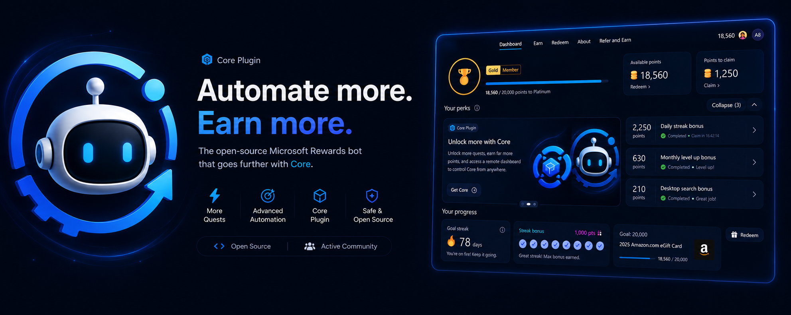

<a href="https://discord.gg/k5uHkx9mne">
  
</a>

## 📌 About This Version (Legacy)

This is the **Legacy version** for the old Microsoft Rewards dashboard. It will continue to receive maintenance updates, but less frequently.

---

<p align="center">
	
</p>

<p align="center">
	<a href="https://nodejs.org/"></a>
	<a href="https://www.typescriptlang.org/"></a>
	<a href="https://discord.gg/k5uHkx9mne"></a>
	<a href="https://git.justw.tf/LightZirconite/Microsoft-Rewards-Bot/src/branch/legacy/"></a>
</p>

<p align="center">
	<strong>The most advanced Microsoft Rewards automation</strong><br />
	Real-time Dashboard · Smart Scheduling · Enterprise Anti-Detection · Multi-Account
</p>

---

## ⚡ Quick Start

```bash
# 1. Clone & navigate (Legacy branch)
git clone -b legacy https://git.justw.tf/LightZirconite/Microsoft-Rewards-Bot.git
cd Microsoft-Rewards-Bot

# 2. One-command setup (installs deps, builds, creates config files)
npm start

# 3. Configure your accounts (files auto-created on first run)
# Edit: src/accounts.jsonc → Add your Microsoft accounts
# Edit: src/config.jsonc → Customize bot behavior (optional)

# 4. Launch
npm start
```

**That's it!** No manual file renaming, no build commands. Everything is automated.

## ✨ Features

### Core Automation

- **🎯 Complete Activity Suite**: Daily Set, More Promotions, Punch Cards, This or That, Polls, Quizzes
- **📖 Read to Earn**: Automatic article completion
- **✅ Daily Check-in**: Never miss your daily streak
- **🎁 Free Rewards**: Auto-claim available offers
- **🔍 Intelligent Searches**: Desktop (30) + Mobile (20) with diverse query sources

### Enterprise-Grade Infrastructure

- **📊 Real-Time Dashboard**: Monitor all accounts, points, activities, and logs via web UI
- **⏰ Smart Scheduler**: Built-in cron with jitter, timezone detection, and vacation mode
- **💾 Job State System**: Resume after crashes, skip completed tasks, multi-pass support
- **🔄 Intelligent Config Merging**: Updates preserve your settings and passwords automatically
- **🔧 Auto-Recovery**: Handles security prompts, passkeys, 2FA, and recovery emails

### Anti-Detection Arsenal

- **🛡️ 23-Layer Protection**: WebDriver removal, canvas noise, WebGL spoofing, audio fingerprinting
- **🖱️ Natural Mouse**: Bézier curves, tremors, overshoot, unique personality per session
- **⌨️ Human Typing**: Variable speed, fatigue simulation, realistic delays (Gaussian distribution)
- **🎭 Browser Fingerprinting**: Consistent per-account, rotates on reset
- **⏱️ Behavioral Randomness**: No fixed timing, thinking pauses, session variation

### Account Management

- **👥 Multi-Account**: Parallel processing with configurable clusters
- **🛠️ Account Creator**: Automated Microsoft account registration (BETA)
- **🔐 Security Handling**: TOTP/2FA, passkeys, recovery emails, compromised account flows
- **🏖️ Vacation Mode**: Random off-days to mimic human patterns
- **⚖️ Risk Management**: Adaptive throttling, ban detection, global standby

### Developer Experience

- **📱 Query Diversity**: Google Trends, Reddit, news feeds, semantic deduplication
- **🔔 Notifications**: Discord webhooks, NTFY push, detailed summaries with points breakdown
- **🐳 Docker Support**: Production-ready containers with volume persistence
- **📝 Comprehensive Docs**: Setup, configuration, troubleshooting, API references
- **🐛 Auto Error Reporting**: Anonymous crash reports to improve stability

<p align="center">
	
</p>

## 📚 Documentation

Comprehensive guides for every use case:

- **[Setup Guide](docs/setup.md)** — Prerequisites and first-time installation
- **[Configuration](docs/configuration.md)** — Customize bot behavior
- **[Config Merging](docs/config-merging.md)** — How updates preserve your settings
- **[Running](docs/running.md)** — Execution modes and commands
- **[Dashboard](docs/dashboard.md)** — Web UI monitoring
- **[Scheduling](docs/scheduling.md)** — Automatic daily runs
- **[Notifications](docs/notifications.md)** — Discord & NTFY setup
- **[Account Creation](docs/account-creation.md)** — Automated registration (BETA)
- **[Docker Deployment](docs/docker.md)** — Containerized production setup
- **[Troubleshooting](docs/troubleshooting.md)** — Common issues and fixes
- **[Update Guide](docs/update.md)** — Keep your bot current

## 🛠️ Essential Commands

```bash
# Primary
npm start              # Full automation (installs deps, builds, runs)
npm run dashboard      # Launch web UI (auto-setup included)

# Development
npm run dev            # TypeScript hot-reload mode
npm run build          # Compile TypeScript only
npm run typecheck      # Validate types without building

# Account Management
npm run creator        # Account creation wizard (BETA)

# Docker
npm run docker:compose # Launch containerized bot
npm run docker:logs    # View container logs

# Maintenance
npm run update         # Update from remote repository (auto-merge configs)
npm run lint           # Check code style
npm run lint:fix       # Auto-fix linting issues
```

## ⚠️ Account Creation Warning

**New accounts flagged if used immediately.** Microsoft detects fresh accounts that earn points on day 1.

**Best practice:** Let new accounts age **2-4 weeks** before automation. Use them manually for browsing/searches during this period.

---

## � Version Comparison

| Version           | Dashboard Support | Update Frequency      | Status          | Link                                                                                 |
| ----------------- | ----------------- | --------------------- | --------------- | ------------------------------------------------------------------------------------ |
| **V4** (Main)     | ✅ New Interface  | 🔥 Active Development | **Recommended** | [Try V4](https://git.justw.tf/LightZirconite/Microsoft-Rewards-Bot/src/branch/main/) |
| **Legacy** (This) | ✅ Old Interface  | ⚠️ Maintenance Only   | Stable          | Current branch                                                                       |
| **TheNetsky V3**  | ✅ Old Interface  | ✅ Updates            | Stable          | Upstream reference                                                                   |

**When to use Legacy:**

- Your region still has the old Microsoft Rewards dashboard
- You want maximum stability with proven code
- You don't need the latest features

**When to upgrade to V4:**

- Your region has the new Microsoft Rewards interface
- You want the latest features and active development
- You're starting a new installation

---

## 🔥 Features Exclusive to LightZirconite Versions

Compared to the original TheNetsky fork, both Legacy and V3 include:

## 🔥 Features Exclusive to LightZirconite Versions

Compared to the original TheNetsky fork, both Legacy and V3 include:

| Feature                   | LightZirconite (Legacy/V3)  | TheNetsky Original  |
| ------------------------- | :-------------------------: | :-----------------: |
| **Real-Time Dashboard**   |    ✅ WebSocket-based UI    |       ✅ Cron       |
| **Built-in Scheduler**    |    ✅ Cron + jitter + TZ    |  ⚠️ External only   |
| **Job State System**      |  ✅ Resume + skip + passes  |         ❌          |
| **Config Auto-Merge**     | ✅ Preserves customizations |         ❌          |
| **Account Creator**       |     ✅ Automated (BETA)     |         ❌          |
| **Vacation Mode**         |     ✅ Random off-days      |         ❌          |
| **Risk Management**       |   ✅ Adaptive throttling    |         ❌          |
| **Compromised Recovery**  |   ✅ Security prompt auto   |         ❌          |
| **Error Reporting**       |  ✅ Anonymous auto-reports  |         ❌          |
| **Query Diversity**       | Google Trends, Reddit, News | Google Trends/Local |
| **Anti-Detection Layers** |      23 active layers       |     ~15 layers      |
| **Comprehensive Docs**    |     ✅ 10+ guide pages      |     ⚠️ Limited      |
| **One-Command Setup**     |       ✅ `npm start`        |   ⚠️ Manual steps   |

### Migration from TheNetsky

```bash
# Compatible account format - just copy your accounts file
cp your-old-accounts.jsonc src/accounts.jsonc
npm start
```

---

## ⚖️ Disclaimer

> ⚠️ **Use at your own risk.**  
> Automation of Microsoft Rewards may lead to account suspension or bans.  
> This software is provided **for educational purposes only**.  
> The authors are not responsible for any actions taken by Microsoft.

---

## 📦 Repository

Primary source:  
🔗 **[git.justw.tf/LightZirconite/Microsoft-Rewards-Bot (legacy branch)](https://git.justw.tf/LightZirconite/Microsoft-Rewards-Bot/src/branch/legacy/)**

---

<p align="center">
	<a href="https://discord.gg/k5uHkx9mne"><strong>💬 Discord</strong></a> · 
	<a href="docs/index.md"><strong>📖 Documentation</strong></a> · 
	<a href="https://git.justw.tf/LightZirconite/Microsoft-Rewards-Bot/issues"><strong>🐛 Report Bug</strong></a>
</p>

<p align="center">
	Made with ❤️ by <a href="https://git.justw.tf/LightZirconite">LightZirconite</a> and <a href="https://git.justw.tf/LightZirconite/Microsoft-Rewards-Bot/activity">contributors</a>
</p>
