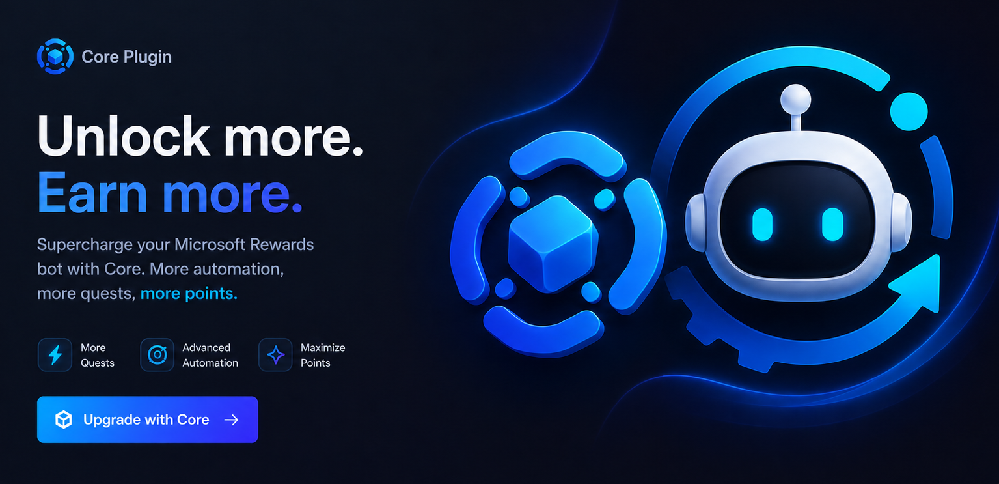

<div align="center">
  
</div>

---

# Core Plugin Technical Reference

This page documents how the official Core plugin behaves, what it covers, and how it is published. For the public-facing overview, see [Official Core plugin](./core-plugin.md).

## Distribution Model

The public bot repository is source-available, but the official Core plugin is proprietary and requires a paid license.

Core is preinstalled in `plugins/core`, shipped as a compiled official artifact, and trusted only when its checksum matches `plugins/official-core.json`.

See [Core release integrity](./core-release-security.md) for public anti-leak and checksum rules.

## Coverage Model

The public edition focuses on the stable Rewards workflow:

- Bing searches;
- limited Daily Set processing;
- simple URL rewards;
- quizzes.

Core adds the maintained premium layer for newer or faster-changing dashboard surfaces:

- claimable point cards;
- dashboard coupon detection and application;
- app rewards;
- streak details;
- streak protection sync;
- best-effort handling for temporary quest and punchcard pages under `/earn/quest/...`;
- advanced side-panel automation;
- final Discord/Ntfy run summaries with Core impact metrics;
- the official remote dashboard.

## Claimable Points And Coupons

Core handles two dashboard side-panel flows:

| Surface | Detection | Action | Result tracking |
| --- | --- | --- | --- |
| Ready-to-claim points | Rewards dashboard card with a points value greater than zero | Opens the claim panel and clicks `Claim points` | Claimed point total and entry count |
| Coupons | Dashboard control text like `Coupon (1)` or `Coupons (N)` | Opens the coupons panel, skips cards already marked `Applied`, and clicks visible apply actions when needed | Coupon count, title, expiry text, and estimated point discount |

Selectors are DOM-driven because Microsoft does not expose a stable public API for these React Aria side panels. Core prefers visible button text, ARIA/dialog scope, and observed Rewards utility classes over dynamic React-generated ids.

Coupon discounts are not normal point earnings. The run summary reports them separately as estimated coupon-discount points instead of adding them to the collected-points balance. If the coupon title is available, the summary includes it so users can see what Core handled.

## Dashboard Card Categories

Not every card shown on the Microsoft Rewards dashboard is a direct point task.

| Card type | Typical behavior |
| --- | --- |
| Standard web activity | Can often be completed directly |
| Search-triggered activity | May require an eligible Bing query |
| Temporary quest / punchcard | Best effort when the page follows a supported pattern |
| Passive progress card | Tracked by Microsoft account state |
| App-only or install task | Reported or skipped |
| Subscription, redeem, or sweepstakes offer | Reported or skipped |

Examples of passive or external items include level-up streaks, default-search progress, installing Edge, installing an extension, using the Bing or Xbox app, redeeming points, subscribing to Game Pass, or entering a sweepstakes.

## Temporary Punchcards

Temporary punchcards are campaign-specific. Core handles the common supported pattern when possible:

1. open the quest page;
2. activate the punchcard if Microsoft exposes an activation action;
3. complete supported `bing.com/search` or simple URL steps;
4. leave redeem, install, subscription, app-only, and time-gated steps as external.

This lets Core support recurring campaign structures without hardcoding every short-lived promotion.

## Dashboard Behavior

Core includes the official remote dashboard and background agent. It starts after a successful license check and opens only an outbound connection to the official dashboard service. It does not expose a local HTTP server or bind to the user's local network.

Users sign in on the official dashboard domain with:

1. their Core license key;
2. Discord OAuth.

The dashboard shows masked account status, run state, recent filtered logs, point summaries, version/update state, auto-start status, diagnostics, and allowlisted actions such as starting a run when the bot is idle.

Dashboard commands are queued and acknowledged asynchronously, so a short delay after an action is expected. Live state is Redis-first: heartbeats, snapshots, logs, and command state stay in Redis with TTLs to protect Turso quota. Turso is used for license/auth state and durable audit records for mutations.

Devices remain visible after going offline so users can inspect the last known state. Deleting a device from the dashboard removes live dashboard state only and does not revoke the license activation.

Sensitive account/config mutations use encrypted command payloads. The dashboard encrypts for the selected device, Redis transports the encrypted payload, and the local bot decrypts and validates before writing local files.

Maintainers can override the service URL for custom deployments:

```jsonc
"core": {
  "enabled": true,
  "priority": 100,
  "config": {
    "dashboardUrl": "https://bot.lgtw.tf"
  }
}
```

## License Validation

Core validates licenses against the official backend. The release build contains the private runtime configuration required for the official service; users do not need to configure database access locally.

The public repository includes only examples for local maintainer tooling. Real private configuration must never be committed.

## Security Boundary

The public plugin API cannot grant official Core entitlement and cannot register premium Core tasks. Only the official compiled Core artifact can unlock those paths in the official release.

Because the source-available repository is modifiable, a local copy can remove local limits from its own files. The license does not permit public redistribution of changes that bypass, unlock, replace, emulate, or reproduce Core. Core remains a paid proprietary plugin.

Compiled local artifacts are not secret storage. Backend authority must remain in Core-API.

Official Core artifacts are runtime-targeted. Windows, Linux, Docker, and ARM64 support require matching official target artifacts.

## Release Checklist

Before copying a new Core build into the public repo:

- verify that no database token, API token, private key, or local `.env` value is committed;
- revoke any token that was ever shipped in bytecode or source;
- run `npx tsc --noEmit` and `npm audit --audit-level=moderate` in both repositories;
- rebuild Core using Node.js `24.15.0`;
- copy only bytecode, package, and license artifacts;
- update the Core API `required_core_version` to the published Core version, and keep `minimum_core_version` aligned unless a deliberate compatibility window is being run;
- verify that `plugins/official-core.json` matches every shipped Core target artifact;
- verify that no `.ts`, `.map`, source `dist/**/*.js`, `.env`, or private secret was copied into the public repository;
- run the checks in [Dashboard testing](./dashboard-testing.md).
